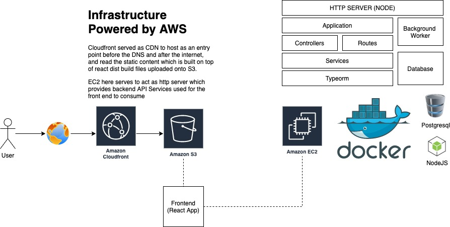

## Auction System - Backend and Frontend Setup

This repository contains the backend and frontend setup for the Auction System.

## Live Preview
You can find live preview with the following link:
- Auction System Demo : [d3ryzw9q3nhlvi.cloudfront.net](https://d3ryzw9q3nhlvi.cloudfront.net/login)
- Backend API Doc : [https://jitera-backend.hendryzheng.com/api-docs](https://jitera-backend.hendryzheng.com/api-docs)
- API Endpoint : [https://jitera-backend.hendryzheng.com](https://jitera-backend.hendryzheng.com)

## Infrastructure Setup
The infrastructure setup for this demo is using AWS Environment with the following adoption usage:
- EC2 Instance : To provision the backend node server runs on Dockerized environment
- S3 : To host React Distribution Build Files serves as static HTML
- CloudFront : Content delivery network (CDN) service that helps to distribute static content loaded S3 from behind

## Full Architecture
To understand better about the full architecture of this demo, please look at below diagram

## Backend

The backend consists of a Docker configuration file (`docker-compose.yml`) and a migration script that needs to be run during the first-time setup.

## OpenAPI Spec

You can also access the API documentation via Swagger UI here [Jitera Backend API Docs](http://jitera-backend.hendryzheng.com:8080)

## Postman Collection

You can also find postman collection for the API documentation here 

### Built With
- (Node.js)[https://nodejs.org/]
- (Express)[https://expressjs.com/]
- (TypeScript)[https://www.typescriptlang.org/]
- (TypeORM)[https://typeorm.io/]
- (PostgreSQL)[https://www.postgresql.org/]

### Guide
You can find full guide for the backend setup in the [Backend Readme](./backend/readme.md)

## Frontend

The frontend is built using React and TypeScript. The `package.json` file contains the dependencies and scripts required for the frontend setup.

## Built With

- [React](https://reactjs.org/) - Front-end framework
- [TypeScript](https://www.typescriptlang.org/) - Typed JavaScript

### Guide
You can find full guide for the frontend setup in the [Frontend Readme](./frontend/README.md)

## Authors

- [HendryZheng](https://github.com/xen-HendryZheng)